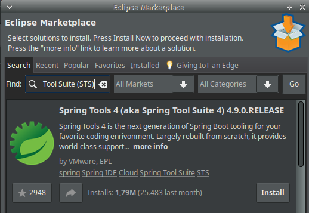
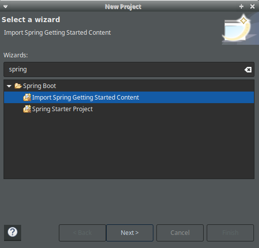
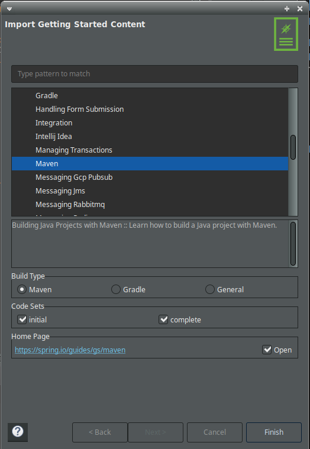

# learningspring
Proyecto para aprender a programar aplicaciones de escritorio con en el entorno
 de trabajo (_Framework_) [_**Spring Boot**_](https://lite.qwant.com/redirect/ZGVkZWRlYWIwZjIyYzdjNGExMWUyZjUwMzZhOGQ2NjQ1ZDU5ODdkMmNiMGExMDczNDk2ODJjMzE1ODY1MTU2OQ==/aHR0cHMlM0ElMkYlMkZzcHJpbmcuaW8lMkZwcm9qZWN0cyUyRnNwcmluZy1ib290?position=2&t=web&l=es&query=spring+boot&ad=0) en sistemas Debian.

## Integración de _Spring Boot_ en Eclipse
1. Ir a `Eclipse -> Help -> Eclipse MarketPlace`, buscar la última versión del
paquete _Spring Tool Suite (STS)_ e instalarlo.



2. Una vez que se ha instalado, comenzar nuevo proyecto:
`File -> New -> Project -> Spring Boot Starter Project`



3. Pulsar `Next` y seleccionar en la siguiente ventana `Maven`. Esto descargará
 una plantilla de proyecto tipo _Maven_ de los repositorios de _Spring_.



Una vez finalizada la creación de un nuevo proyecto de _Spring Boot_, se crearán
dos proyectos de tipo _Maven_ con los nombres:
- `gs-maven/complete`
- `gs-maven/initial`

Al usar el asistente de `nuevo proyecto -> Spring Boot`, para cada uno de los
proyectos anteriores ya se han efectuado los siguientes pasos:

1. Creación de la estructura de directorios.
2. Creación del fichero de configuración de _Maven_.
3. Declaración de dependencias.
4. Creación de clases de prueba (test).

## Integración de _Spring Boot_ en la terminal
### 1. Instalación de [_Maven_](https://maven.apache.org/)
Con la configuración del punto anterior ya sería posible trabajar con
_Spring Boot_, pero muchas veces es necesario trabajar desde la terminal. Por
eso, en este apartado se va a configurar la herramienta _Maven_ para usar desde
la terminal.


1. Instalación de _Maven_:
```bash
sudo apt update
sudo apt install maven
```
2. Comprobar que se ha instalado correctamente:
```bash
mvn -v
```
La salida debe ser parecida a esta:
```
Apache Maven 3.6.3
Maven home: /usr/share/maven
Java version: 1.8.0_282, vendor: Private Build, runtime: /usr/lib/jvm/java-8-openjdk-amd64/jre
Default locale: es_ES, platform encoding: UTF-8
OS name: "linux", version: "5.4.0-66-generic", arch: "amd64", family: "unix"
```

### 2. Instalación de _Spring Boot_ con SDKMan

Esta herramienta de gestión automática de SDK es muy útil a la hora de instalar
diferentes SDK, entre ellos, _Spring Boot_.
```bash
# Instalar SDKMan
curl -s "https://get.sdkman.io" | bash

# Inicializar SDKMan
source "$HOME/.sdkman/bin/sdkman-init.sh"

# Comprobar que SDKMan se ha instalado correctamente
sdk version

# Instalación de _Spring Boot_
sdk install springboot

# Comprobar que _Spring Boot_ se ha instalado correctamente
spring --version

```

### 3. Ejecutar el proyecto nuevo
#### 3.1 Desde Eclipse:
`Botón derecho sobre el proyecto a ejecutar -> Run As Java Application`

#### 3.2 Desde la terminal:
```bash
# Cambiar al directorio del proyecto
cd ~/Workspace/eclipse-jee-2020-12-R/gs-maven-complete/

# Ejectuar el proyecto
mvn org.springframework.boot:spring-boot-maven-plugin:run
```

Más información sobre cómo crear proyectos _Spring Boot_ desde la terminal:
https://spring.io/guides/gs/maven/.
